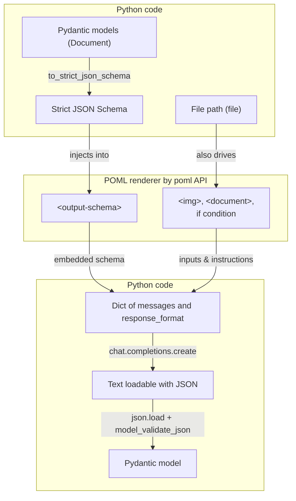

# Travel Expense Agent - Part 1: Building a Complete AI Workflow

Welcome to the Travel Expense Agent tutorial! This guide builds on what you learned in the [quickstart](quickstart.md) and shows you how to create a sophisticated AI application that processes real business documents. We'll build an intelligent expense processing system that extracts data from receipts, validates against company policies, and generates automated responses.

## What We're Building

Our travel expense agent handles the complete workflow of expense processing. When an employee submits expense documents, the system needs to extract structured data, check compliance against company policies, and respond with either approval or specific corrections needed. This is a perfect example of how POML, Python and VS Code work together to solve complex, multi-step business problems. We will focus on the Python workflow in this part, and cover debugging with the VS Code extension in [part 2](expense_part2.md).

The system processes various document formats including PDF invoices, image receipts, Excel budget tables, and Word policy documents. Each step in the workflow builds on the previous one, creating an agentic pipeline that can handle real-world business complexity.

## Prerequisites and Setup

Before we start, make sure you have Python 3.9+ installed and the POML Python SDK ready to go:

```bash
pip install poml openai pydantic
```

You'll also need an OpenAI API key configured in your environment. The beauty of POML is that it works with multiple LLM providers, so you can easily switch between OpenAI, Anthropic, or others as needed.

## Understanding POML's Python Integration

The POML Python SDK provides powerful integration capabilities that make it easy to build structured AI workflows. The core concept is simple: POML files act as templates that get rendered with your Python data, then sent to LLMs to get structured responses back.

Let's start with the most essential imports:

```python
import poml
```

## Step 1: Extracting Structured Data from Documents

The first step in our workflow takes raw documents and extracts structured business data. This is where POML's document handling capabilities really shine.

First, let's define the Python data structures we want to extract. The approach is very similar to [Structured Output with OpenAI](https://platform.openai.com/docs/guides/structured-outputs):

```python
from pydantic import BaseModel, Field
from typing import List, Optional, Literal

class LineItem(BaseModel):
    date: Optional[str] = Field(..., description="YYYY-MM-DD")
    description: str
    category: str = Field(..., description="e.g., lodging, meals, ground_transportation, rental_car")
    amount: float

class TotalByCategory(BaseModel):
    category: str
    amount: float

class Document(BaseModel):
    source: str = Field(..., description="Filename or doc label")
    doc_type: Literal["hotel_invoice", "flight_itinerary", "receipt", "other"]
    merchant: Optional[str] = Field(..., description="Merchant or provider name")
    currency: Optional[str] = Field(..., description="ISO currency code, e.g., USD, EUR")
    lines: List[LineItem]
    subtotals_by_category: List[TotalByCategory]
```

Now let's write the Python code to process our documents:

```python
from openai import OpenAI
from poml.integration.pydantic import to_strict_json_schema

client = OpenAI()

documents = []
document_paths = [
    "assets/flight_itinerary.pdf",
    "assets/hotel_invoice.pdf",
    "assets/meal_receipt.png",
    "assets/taxi_receipt.png"
]

for document_path in document_paths:
    context = {
        "file": document_path,
        "document_output_schema": to_strict_json_schema(Document),
    }

    extraction_prompt = poml.poml(
        "expense_extract_document.poml",
        context,
        format="openai_chat"
    )

    response = client.chat.completions.create(
        **extraction_prompt,
        model="gpt-5"
    )

    document = Document.model_validate_json(
        response.choices[0].message.content
    )
    documents.append(document)
```

!!! note

    The `to_strict_json_schema` function automatically converts your Pydantic models into JSON schemas that guide the LLM's output format. You can also use `Document.model_json_schema()` from [Pydantic official](https://docs.pydantic.dev/latest/concepts/json_schema/) instead of `to_strict_json_schema()`, but it may produce a less strict schema that may result in 400 Bad Request errors from the LLM.

Now let's create the POML file that handles the document extraction (and save it to `expense_extract_document.poml`):

```xml
<poml>
  <task>Classify travel docs and extract with high recall. Return numbers as numbers. Compute ONLY per-document subtotals by category.</task>

  <cp caption="File: {{ file }}">
    
    <document if="{{ file.endsWith('.pdf') }}" src="{{ file }}" parser="pdf" />
  </cp>

  <hint>For each file, return JSON per schema. If unknown, omit. Avoid hallucinating.</hint>
  <output-schema>{{ document_output_schema }}</output-schema>
</poml>
```

!!! note

    The `<task>` and `<hint>` components are both "intention components" that help organize your prompts. They serve to denote special parts of instructions. When rendered, the only difference between them is their caption - `<task>` renders with "# Task" while `<hint>` renders with `**Hint:**`. Using these semantic components is not necessary when using POML, but they help you maintain clean, understandable, optimizable prompt structures rather than mixing all instructions together.

This POML demonstrates several powerful features. The `if` attribute on components allows conditional rendering based on file type. When the POML engine evaluates `if="{{ file.endsWith('.png') }}"`, it only includes that component if the condition is true. This lets us handle different document types with appropriate parsers - images are processed as visual content while PDFs are parsed to extract text and structure. With a PDF context available, this prompt renders to something like:

```text
# Task

Classify travel docs and extract with high recall. Return numbers as numbers. Compute ONLY per-document subtotals_by_category (no combined totals).

# File: assets/203_flight_itinerary.pdf

Flight Itinerary
Passenger Name John Doe
Booking Reference ABC123
Flight Airline From To Date Departure Arrival
XY123 Sample Air New York (JFK) London (LHR) 01-Oct-2025 18:30 06:45
XY124 Sample Air London (LHR) New York (JFK) 10-Oct-2025 10:00 13:00

**Hint:** For each file, return JSON per schema. If unknown, omit. Avoid hallucinating.
```

The `poml.poml()` call renders our POML file with the provided context and formats it for OpenAI's API. Behind the scenes, POML reads the PDF / images files from your file system, and formats them into the prompt, so that you do not need to worry about how to send multi-media contexts to LLMs at all.

POML also takes the Pydantic schema converted to JSON, embeds it in the prompt, and includes it as a `response_format` parameter in the API call. While you could manually pass the `Document` model directly to `client.chat.completions.create`, using POML centralizes all prompt components in one place, making it easier to debug and maintain. We'll explore these debugging capabilities in [part 2](expense_part2.md).



## Step 2: Identifying Relevant Policy Rules

Once we have structured document data, we need to determine which company policies apply to this specific expense report. This step demonstrates how POML handles multiple data sources and complex business logic.

The Python code follows the same pattern, but notice how we pass the results from step 1 as input to step 2.

```python
class TripContext(BaseModel):
    ... # omitted for brevity

class Rule(BaseModel):
    ... # omitted for brevity

class RelevantRules(BaseModel):
    trip_context: TripContext
    rules: List[Rule]

employee_email = """
Hi, I just got back from a business trip to New York. Attached are my expense reports.
Please let me know if you need any more information.
"""

context = {
    "email_text": employee_email,
    "extracted_documents": [doc.model_dump() for doc in documents],  # Results from step 1
    "rules_output_schema": to_strict_json_schema(RelevantRules),
}

rules_prompt = poml.poml(
    "expense_extract_rules.poml",
    context,
    format="openai_chat"
)

rules_response = client.chat.completions.create(**rules_prompt, model="gpt-5")
relevant_rules = RelevantRules.model_validate_json(rules_response.choices[0].message.content)
```

Now let's look at the POML file for rule extraction that considers the employee's email, company policy documents, budget tables, and the extracted documents from step 1. Save it as `expense_extract_rules.poml`:

```xml
<poml>
  <task>From the employee email, policy documents, and budget data, select rules that apply to the extracted documents. Focus on numeric caps and binary requirements.</task>

  <cp caption="Travel Budget Table">
    <table src="assets/travel_budget_table.xlsx" syntax="csv" />
  </cp>

  <cp caption="Travel Policy Document">
    <document src="assets/travel_expense_policy.docx" />
  </cp>

  <human-msg>
    <cp caption="Email from Employee">
      <text syntax="text">{{ email_text }}</text>
    </cp>

    <cp caption="Extracted Documents">
      <object data="{{ extracted_documents }}" syntax="xml" />
    </cp>
  </human-msg>

  <output-schema>{{ rules_output_schema }}</output-schema>
</poml>
```

Notice how this file uses different component types to handle various data sources. The `<table>` component handles Excel files with `syntax="csv"` to format the output as comma-separated values for better LLM readability. The `<document>` processes Word files. For the `<text>` component, `syntax="text"` preserves the plain text formatting of the email. The `<object>` component with `syntax="xml"` serializes our Python data structures (exported via `model_dump()` into a dict) as XML for structured representation in the prompt.

This step demonstrates the power of POML's data flow capabilities. We're taking structured outputs from one step and using them as structured inputs to the next step, while also incorporating additional business context like policy documents and employee communications.

## Step 3: Checking Compliance Against Rules

With our documents extracted and relevant rules identified, we need to validate compliance. This step performs the actual business logic of expense validation, checking each extracted expense against applicable rules and identifying violations. The Python code continues our data pipeline. The output structure captures both the financial totals and detailed rule violations:

```python
class RuleCheck(BaseModel):
    ... # omitted for brevity

class ComplianceCheck(BaseModel):
    totals_by_category: List[TotalByCategory]
    overall_total_usd: float
    rule_checks: List[RuleCheck]
    decision: Literal["approve", "needs_fixes", "reject"]

context = {
    "trip_context": relevant_rules.trip_context.model_dump(),
    "extracted_documents": [doc.model_dump() for doc in documents],
    "relevant_rules": relevant_rules.model_dump(),
    "compliance_output_schema": to_strict_json_schema(ComplianceCheck),
}

compliance_prompt = poml.poml(
    "expense_check_compliance.poml",
    context,
    format="openai_chat"
)

compliance_response = client.chat.completions.create(**compliance_prompt, model="gpt-5")
compliance_check = ComplianceCheck.model_validate_json(compliance_response.choices[0].message.content)
```

The compliance checking POML file brings together all our data sources. Save it as `expense_check_compliance.poml`:

```xml
<poml>
  <task>Check extracted documents against relevant rules. Calculate totals, identify violations, and determine approval status.</task>

  <human-msg>
    <cp caption="Trip Context">
      <object data="{{ trip_context }}" syntax="xml" />
    </cp>

    <cp caption="Extracted Documents">
      <object data="{{ extracted_documents }}" syntax="xml" />
    </cp>

    <cp caption="Relevant Rules">
      <object data="{{ relevant_rules }}" syntax="xml" />
    </cp>
  </human-msg>

  <hint>
    Calculate totals by category. Check each rule against the evidence.
    Determine severity of violations and suggest specific fixes.
  </hint>

  <output-schema>{{ compliance_output_schema }}</output-schema>
</poml>
```

This POML focuses entirely on the compliance logic, taking structured inputs and producing structured compliance results. At this point, our system has processed raw documents through structured extraction, identified relevant policies, and performed detailed compliance checking. The `compliance_check` object contains everything needed to make business decisions about the expense report.

## Step 4: Generating Automated Email Responses

The final step generates appropriate email responses based on the compliance check results. This demonstrates how POML can handle different output formats and integrate with business systems like email.

The Python code for tool calls works seamlessly:

```python
context = {
    "trip_context": relevant_rules.trip_context.model_dump(),
    "compliance_result": compliance_check.model_dump(),
}

email_prompt = poml.poml(
    "expense_send_email.poml",
    context,
    format="openai_chat"
)

# The POML rendering automatically includes tool definitions
email_response = client.chat.completions.create(
    **email_prompt,
    model="gpt-5",
)

# Handle the tool call
tool_call = email_response.choices[0].message.tool_calls[0]
email_args = json.loads(tool_call.function.arguments)
send_email(**email_args)  # Your email implementation
```

Our email generation POML needs to produce different types of responses depending on the compliance results. Save it as `expense_send_email.poml`:

```xml
<poml>
  <task>
    <p>Use the tool to notify the employee about the expense report decision. Under 200 words.</p>
    <p>Summarize decision, list only the key violations with fixes, and include category totals and the overall total.</p>
  </task>

  <human-msg>
    <cp caption="Travel Context">
      <object data="{{ trip_context }}" syntax="xml" />
    </cp>

    <cp caption="Compliance Check Result">
      <object data="{{ compliance_result }}" syntax="xml" />
    </cp>
  </human-msg>

  <tool name="send_email" description="Send an email" parser="eval">
  z.object({
    to: z.string(),
    subject: z.string(),
    body: z.string(),
  })
  </tool>
</poml>
```

This POML introduces tool calling capability. Instead of returning structured data, it instructs the LLM to call a function. The `parser="eval"` attribute tells POML to evaluate the tool schema using [Zod (a JavaScript schema validation library)](https://zod.dev/). When rendered, POML automatically converts this into the appropriate tool definition format for the target LLM API, including it in the returned `email_prompt` dictionary (similar to the `response_format` above). This means you don't need to manually define tools in your Python code - POML handles the conversion for you.

## Running the Complete Example

To see the full system in action, the full prompt files are available at:

- [Document extraction](https://github.com/microsoft/poml/tree/HEAD/examples/203_expense_extract_document.poml)
- [Rule extraction](https://github.com/microsoft/poml/tree/HEAD/examples/204_expense_extract_rules.poml)
- [Compliance checking](https://github.com/microsoft/poml/tree/HEAD/examples/205_expense_check_compliance.poml)
- [Email generation](https://github.com/microsoft/poml/tree/HEAD/examples/206_expense_send_email.poml)

The full Python implementation is available at [travel expense agent](https://github.com/microsoft/poml/tree/HEAD/examples/404_travel_expense_agent.py). You can run it by:

```bash
python 404_travel_expense_agent.py
```

This will process sample documents and walk through the complete workflow, showing you structured outputs at each step and the final email generation.

## Next Step

- Try the example file [404_travel_expense_agent.py](https://github.com/microsoft/poml/tree/HEAD/examples/404_travel_expense_agent.py).
- Explore different options with `syntax`.
- Go to [part 2](expense_part2.md) to learn how to debug and optimize your prompts using the VS Code extension.
