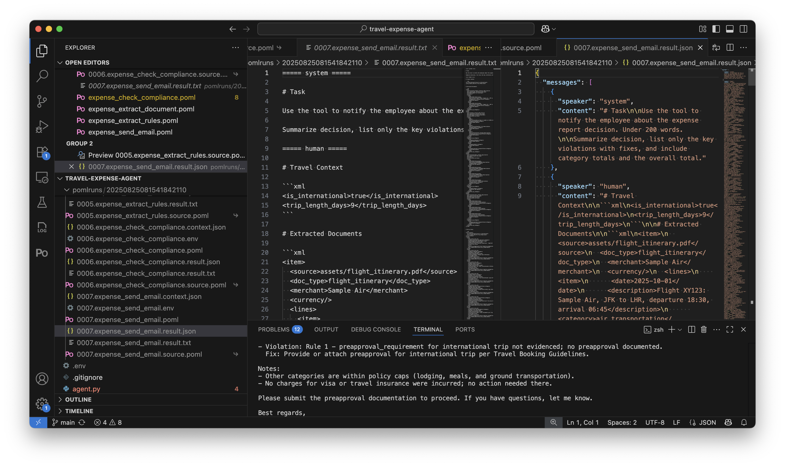
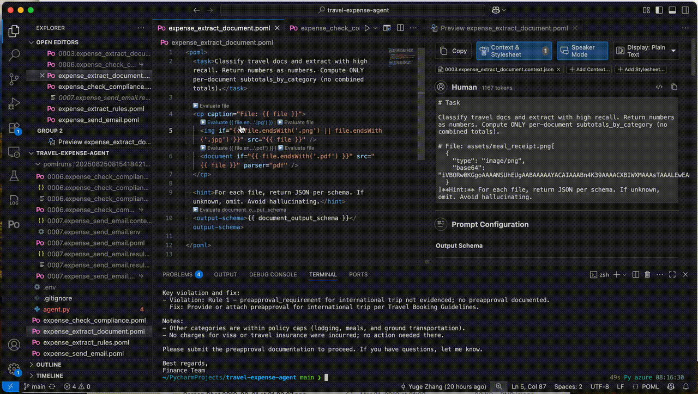
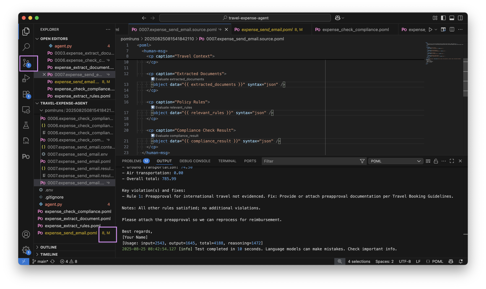

# Travel Expense Agent - Part 2: Debugging and Optimizing with VS Code

Welcome to Part 2 of the Travel Expense Agent tutorial! In [Part 1](expense_part1.md), we built a complete AI workflow using POML and Python. Now we'll explore how the [VS Code extension](../vscode/index.md) transforms the debugging and optimization experience, making it dramatically easier to iterate on prompts and diagnose issues without constantly rerunning your entire Python workflow.

## Why Debugging Matters for AI Workflows

When building AI applications, the challenge isn't just getting code to run - it's understanding why the LLM produced certain outputs and how to improve them. Traditional debugging approaches fall short because prompts are dynamic, context-dependent, and the LLM's behavior can vary. POML's VS Code extension solves these problems by providing visibility into every stage of prompt rendering and execution.

The real power comes from being able to capture the exact state of your prompts in production, then iterate on them locally without needing to recreate complex runtime conditions. This workflow dramatically reduces the time from identifying an issue to deploying a fix.

## Setting Up Tracing in Python

Make sure you have the VS Code extension installed. You can find installation instructions in the [VS Code documentation](../vscode/index.md).

Before we dive into VS Code features, let's understand how tracing captures the complete process of your AI workflow. When we ran the expense agent in Part 1, adding a single line transformed our debugging capabilities. Remember to add pomlruns to `.gitignore` if you haven't already.

```python
import poml

# Enable tracing for all POML calls
poml.set_trace(trace_dir="pomlruns")
```

This simple addition creates a comprehensive audit trail of every interaction with the LLM. Let's see what happens when we run our expense workflow:


The tracing system captures what we call the "crime scene" --- the exact state of your prompts at the moment before they're sent to the LLM. This includes the POML source, all context variables, the rendered output, and even environment metadata. When something goes wrong in production, these trace files give you everything needed to reproduce and fix the issue locally.

## Understanding Trace Output Structure

After running the expense agent with tracing enabled, you'll find a timestamped directory containing all the captured interactions. Each execution generates multiple files that capture different aspects of the interaction. The `.context.json` files contain the exact data passed to each POML renderer, the `.poml` files show the source templates, and the `.result` files reveal what was actually sent to the LLM. Here's what a traced result looks like for our send email step:



The trace `.result` files also show the complete rendered prompt with all template variables replaced, giving you perfect visibility into what the LLM actually processes. This is valuable when debugging why a particular document wasn't extracted correctly or when optimizing prompts for better accuracy.

## Working with Context Files in VS Code

One of the powerful features of the VS Code extension is automatic context detection and loading. In the trace directory, you can see a `.context.json` file next to your POML source file. The extension automatically detects and uses it as the "paired context file" for the POML file. In addition, the VS Code extension also provides a live preview that updates as you edit your POML files:


The preview shows exactly how your prompt will render with the attached context, including conditional components, template variable substitutions, and formatted output schemas. This immediate feedback loop accelerates prompt development by showing you the results of your changes instantly. This also means that you can take a problematic interaction from production and immediately start iterating on the prompt locally. The context file contains all the runtime data, so you're working with exactly the same inputs that caused the issue.

In case a `.context.json` file isn't automatically detected, do not worry. You can still manually attach it on the preview panel:


## Local Expression Evaluation and Debugging

The VS Code extension provides CodeLens buttons that let you evaluate template expressions directly in your editor. This feature is particularly useful when working with complex conditional logic or data transformations:



When you click the "▶️ Evaluate" button above any expression, the extension evaluates it using your attached context and displays the result in the VS Code output panel. This helps you understand exactly what values your expressions produce without needing to run the entire workflow.

For our expense extraction template, you can evaluate expressions like `{{ file.endsWith('.pdf') }}` to verify your conditional logic, or `{{ document_output_schema }}` to see the complete JSON schema being sent to the LLM.

## Iterative Prompt Refinement Workflow

With all these tools in place, let's walk through a real debugging scenario. Suppose our compliance checking step isn't properly validating expenses against policy rules. Here's how we'd diagnose and fix the issue using the VS Code extension.

First, we locate the problematic execution in our trace directory. The trace files show us exactly what was sent to the LLM. On the right of each `.source.poml` file items, you can see a small link icon, indicating that it's a soft link to the original POML file. Clicking it opens the link file directly:



Looking at the highlighted changes in the editor, we can see the power of iterative refinement. The original prompt was using `syntax="xml"` to render all the context data. For brevity, we wish to change it to `syntax="json"`. We can directly edit here, and the git-tracked POML source file will be updated accordingly.

We can test our changes immediately using the VS Code test command, discussed in the next section.

## Testing Individual Prompts Without Python

Perhaps the most powerful debugging feature is the ability to test individual prompts directly in VS Code, without running your Python workflow. This will significantly speed up iteration when refining specific steps:


Firstly, the side-by-side view shows the immediate impact - on the left, we're editing the POML source, and on the right, the preview panel instantly shows how this renders with our attached context. The preview confirms that our policy rules (including budget limits, receipt requirements, and expense categories) are now being included in the prompt with proper JSON formatting.

The extension then uses your attached context file and sends the rendered prompt directly to the configured LLM. You can test against different models, compare outputs, and refine your prompts all within VS Code. This is especially valuable when debugging a specific step in a multi-stage workflow - you don't need to rerun steps 1-3 just to test changes to step 4.

To enable this testing, configure your LLM settings (providers, models and API keys) in VS Code:


The settings support multiple providers including OpenAI, Anthropic, Azure OpenAI, and Google GenAI. You can quickly switch between models to test compatibility and compare outputs across different LLMs. After the configuration, hit the "Play" button in the upper right corner of your editor to run the test.

## Summary and Next Steps

The VS Code extension transforms POML from a templating language into a complete prompt engineering toolkit. By combining Python-based tracing with VS Code's interactive debugging features, you can build, test, and optimize AI workflows with unprecedented visibility and control.

The key insight is that prompts are code, and they deserve the same tooling and practices we apply to traditional software development. The trace-based workflow provides the visibility, the VS Code extension provides the interactivity, and together they make prompt engineering systematic and reliable.

To continue your journey with POML:

- Explore the [VS Code configuration options](../vscode/configuration.md) to customize your development environment
- Learn about [advanced tracing](../python/trace.md) and how to integrate it into other tracing systems
- Review the [complete POML language reference](../language/components.md) to discover advanced features
- Try building your own multi-step AI workflows using the patterns from this tutorial

The combination of POML's structured approach, Python's flexibility, and VS Code's debugging capabilities provides everything you need to build robust, maintainable AI applications. Happy prompting!
