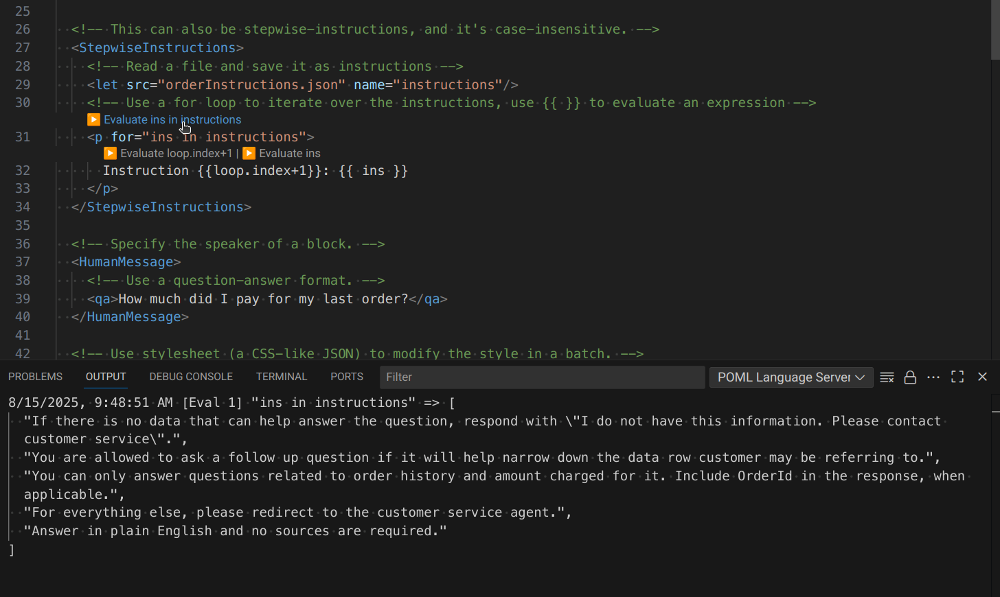

# VS Code IntelliSense Features

POML comes with features that enhance your editing experience in Visual Studio Code, offering a more interactive way to work with your prompt files. Here’s how to make the most of these features:

### Diagnostics


The POML extension provides real-time error detection and validation for your `.poml` files through VS Code's diagnostics system. This helps you catch syntax errors, invalid attributes, and other issues as you write your prompts.

#### Types of Diagnostics

The POML extension detects various types of issues:

- **Syntax Errors**: Invalid XML/POML syntax, unclosed tags, malformed attributes
- **Component Validation**: Unknown components or incorrect component usage
- **Attribute Errors**: Invalid attributes for specific components or incorrect attribute values
- **File Reference Issues**: Problems with referenced context files, stylesheets, or other external resources
- **Expression Evaluation Errors**: Issues with template expressions and variable references

#### Real-time Validation and Working with Multiple Files

Diagnostics are updated automatically as you edit:

1. **On File Save**: Complete validation is triggered when you save the file
2. **Incremental Updates**: Basic syntax checking happens as you type
3. **Context-aware**: Validation considers your context files and stylesheets for more accurate error reporting

The diagnostics system can validate references across multiple files. It vlidates that referenced `.context.json` files exist and are properly formatted. It also checks `.stylesheet.json` files for syntax and structure issues.

### Hover Tooltips

When you hover over tags, attributes, or expression parts in your `.poml` file, VSCode will display helpful tooltips.

- **Tags:** Hovering over a tag (e.g., `<p>`) will show you the documentation for that component (if available).
- **Attributes:** Hovering over an attribute (e.g., `speaker` in `<p speaker="human">`) will show you the documentation for that attribute, including its type and accepted values.
- **Errors:** Hovering over a problematic element, it will show you the error cause and reason, which will help you understand the issue and fix it.

To use it, simply open your `.poml` file in VSCode and hover over any token.

### Side Preview

The side preview feature shows a live rendering of your prompt. As you make changes, you can see how your prompt structure and styles are applied.

Install the POML VSCode extension, then open your `.poml` file. Activate the side preview panel by:

1. **Click Show Preview Button:** Click the show preview button at the top-right corner of active editor, or type "POML: Open POML Preview" in the command palette and select the command.
2. **Side-by-side:** The preview will update automatically as you edit.

### Auto-completion

Autocompletion assists you by suggesting component tags, attribute names, and possible attribute values. This helps ensure your syntax is correct and speeds up development.

While editing a `.poml` file in VSCode:

- **Tag Completion:** Start typing a tag name (e.g., `<p`). VSCode with the POML extension will offer completions, such as `<p>`, `<paragraph>`, or other available components. It also suggests closing tags.
- **Attribute Completion:** Inside an opening tag, type a space or start typing an attribute name (e.g., `class`).  You'll see suggestions for valid attributes for that component (e.g., `className`).
- **Attribute Value Completion:**  For some attributes, POML can suggest possible values. For example, if you type `<question speaker="`, you might see suggestions like `"human"` or `"ai"`.

This feature significantly improves the efficiency and accuracy of writing POML code.

### Expression Evaluation with CodeLens



The POML extension provides CodeLens buttons that allow you to evaluate template variables directly in your editor. This powerful debugging feature helps you understand what values your expressions produce locally.

#### How to Use Expression Evaluation

1. **CodeLens Buttons**: When you open a `.poml` file, you'll see "▶️ Evaluate" buttons appearing above expressions and variables.
2. **Click to Evaluate**: Click any "▶️ Evaluate" button to execute the expression and see its result.
3. **View Output**: Go to View → Output in VS Code. Results are displayed in the **POML Language Server** output channel.

#### What Gets Evaluated

The CodeLens evaluation feature works with:

- **Template Expressions**: Any `{{ expression }}` in your POML content
- **Variable Definitions**: `<let>` element value attributes
- **Control Flow**: Expressions in `for` and `if` attributes
- **Schema Expressions**: Expressions in meta elements with `lang="expr"`

#### Example

```xml
<poml>
  <let name="items" value='["apple", "banana", "cherry"]' />
  <let name="count" value="items.length" />
  
  <p>We have {{ count }} items: {{ items.join(', ') }}</p>
  
  <meta type="responseSchema" lang="expr">
    z.object({
      total: z.number().max(count),
      items: z.array(z.enum(items))
    })
  </meta>
</poml>
```

In this example, you can evaluate:
- The `items` array definition to see `["apple", "banana", "cherry"]`
- The `count` calculation to see `3`
- The template expressions to see `"3"` and `"apple, banana, cherry"`
- The schema expression to see the generated Zod schema object

## Testing Prompts


POML provides integrated testing capabilities that allow you to test your prompts directly within VS Code against various language models. This feature helps you validate your prompts and see their output without leaving the editor.

### Testing with Chat Models

Use the **Test current prompt on Chat Models** command to test your `.poml` file with chat-based language models. This sends your prompt to the configured language model and displays the response in VS Code's output panel.

### Testing with Text Completion Models  

For non-chat models, use the **Test current prompt on Text Completion Models** command. This is useful for testing prompts designed for text completion rather than conversational AI models.

### Rerunning Tests

The **Clear output and rerun last test** command allows you to quickly clear the previous output and rerun your last test, making it easy to iterate on your prompts.

### Aborting Tests

If a test is taking too long or you need to stop it, use the **Abort current prompt test** command to cancel the ongoing request.

Before testing prompts, make sure you have configured your [language model settings](./configuration.md):
- Set your model provider (OpenAI, Azure OpenAI, Anthropic, or Google GenAI)
- Configure your API key and endpoint URL
- Choose your preferred model name

## Prompt Gallery

The Prompt Gallery provides access to pre-built prompt templates and allows you to manage your own custom prompts. Access it from the POML activity bar in VS Code.

### Built-in Templates

The gallery includes several built-in prompt templates covering common use cases:
- **Ask**: General question-answering prompts
- **Chat**: Conversational prompts
- **Edit**: Text editing and revision prompts

Gallery prompts can be used with the POML chat participant by typing `@poml /<prompt-name>` in any VS Code chat interface, where `<prompt-name>` is the name of your gallery prompt.

### Managing Custom Prompts

You can add your own prompts to the gallery:

1. **Add Prompt**: Click the plus (+) icon in the gallery view to add a new prompt template
2. **Edit Prompt**: Use the pencil icon to modify existing user-created prompts
3. **Delete Prompt**: Remove prompts you no longer need with the trash icon

The usage of custom prompts are the same as built-in prompts. You can use them in the POML chat participant or test them directly.

## List of Available Commands

| Command | Description |
|---------|-------------|
| `poml.test` | Test current prompt on Chat Models |
| `poml.testNonChat` | Test current prompt on Text Completion Models |
| `poml.testRerun` | Clear output and rerun last test |
| `poml.testAbort` | Abort current prompt test |
| `poml.showPreview` | Open POML Preview |
| `poml.showPreviewToSide` | Open POML Preview to the Side |
| `poml.showLockedPreviewToSide` | Open Locked POML Preview |
| `poml.showSource` | Show Source File |
| `poml.addContextFile` | Add Context File |
| `poml.addStylesheetFile` | Add Stylesheet File |
| `poml.removeContextFile` | Remove Context File |
| `poml.removeStylesheetFile` | Remove Stylesheet File |
| `poml.gallery.addPrompt` | Add Prompt to Gallery |
| `poml.gallery.deletePrompt` | Delete Prompt from Gallery |
| `poml.gallery.editPrompt` | Edit Prompt in Gallery |
| `poml.telemetry.completion` | Telemetry: Completion |